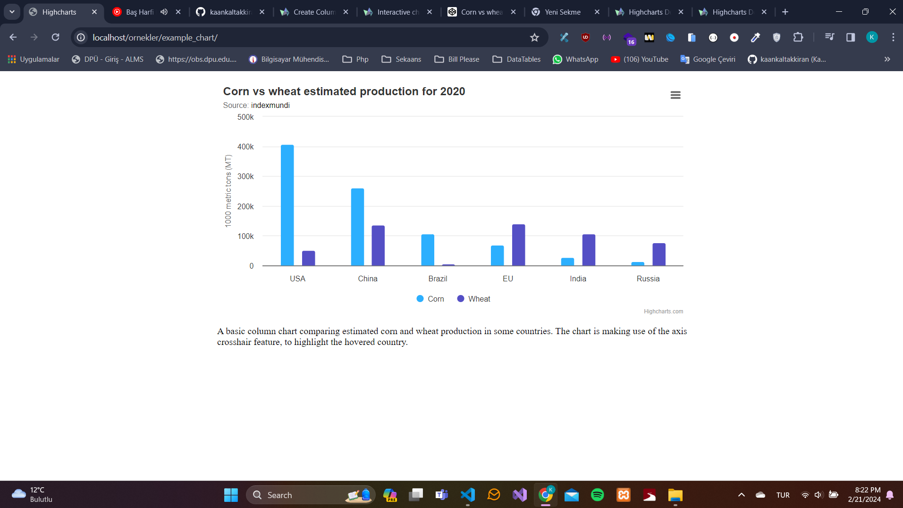
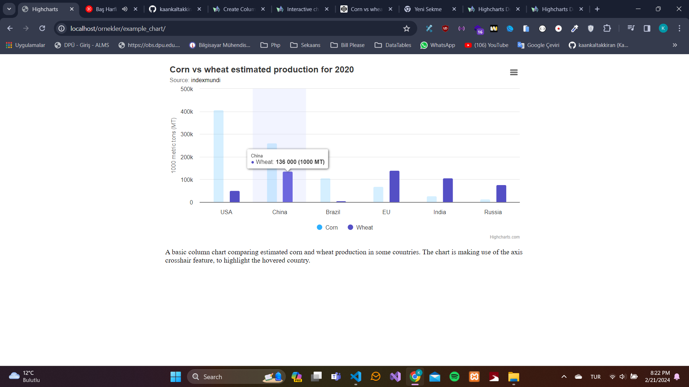
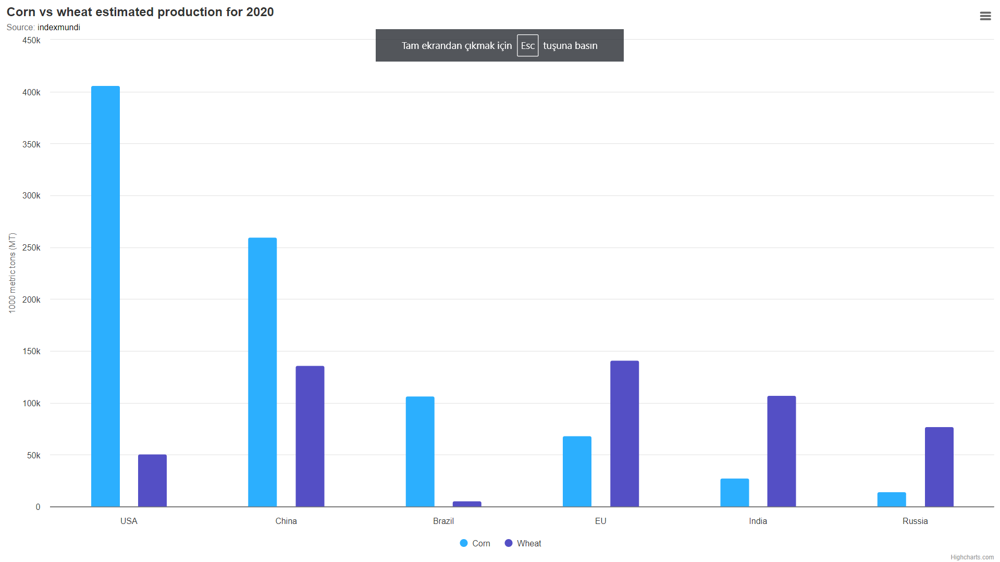
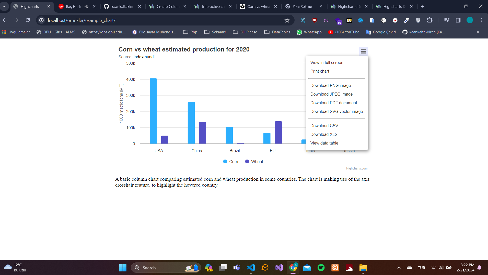
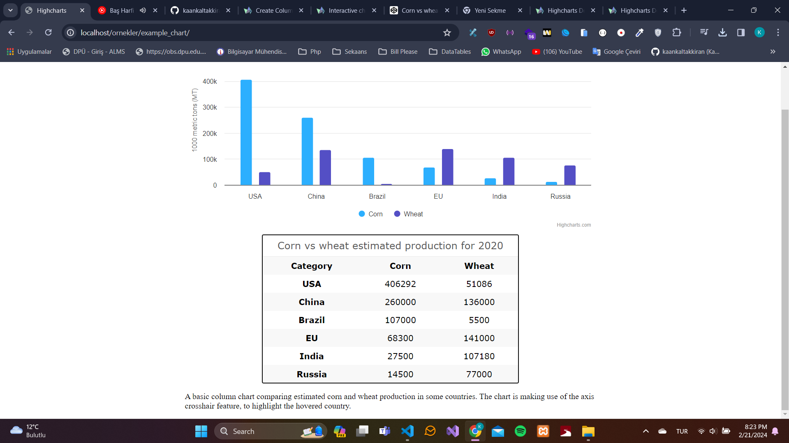

# Highcharts

## Highcharts nasıl kullanılır ?
Highcharts, web sayfalarında interaktif grafikler oluşturmak için kullanılan bir JavaScript kütüphanesidir. Bu kütüphane, web sayfalarında çeşitli grafikler oluşturmak için kullanılır.

Kullanımı oldukça kolay ve esnek bir yapıya sahiptir.

Highcharts, grafiğinin olduğu kısımda 3 çizgiye tıkladığımızda bir sürü özellik barınmaktadır. 

Örneğin, grafiği istersek ful pencere olarak açabiliriz. Bu sayede grafiği daha detaylı inceleyebiliriz. Bu grafiği jpg, png, pdf, svg formatlarında indirebiliriz. Ayırca View data table seçeneği ile grafiğin verilerini tablo halinde görebiliriz. 

Nasıl kullanıldığını öğrenmek için [Highcharts](https://www.highcharts.com/) sitesini ziyaret edebilirsiniz.

Birden çok grafik türü bulunmaktadır. Hangisinin kullanılacağına karar vermek için [demo](https://www.highcharts.com/demo) tıklayabilirsiniz.

### Örnek Highcharts resimleri 

