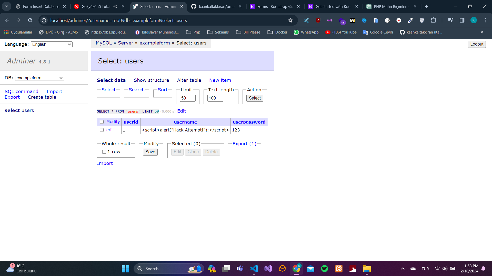
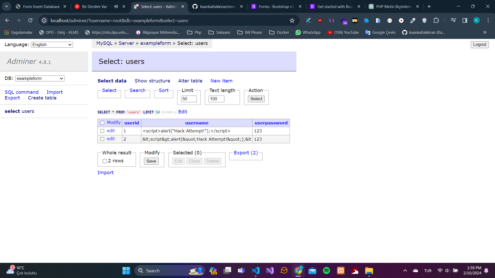

# Php Mysql ile Form Veri Ekleme
Php ile formdan gelen verileri mysql veritabanına eklemek için örnek bir proje.
Kullanıcıdan formdan gelen verileri htmlspecialchars() fonksiyonu ile güvenli bir şekilde kaydetmekteyiz.
htmlspecialchars, html etiketlerini etkisiz hale getirir. Örneğin  gibi bir veri gönderirse bu veri veritabanına &lt;script&gt;alert(&quot;Hack Attempt!&quot;);&lt bu şekilde kaydedilir.
## Örnek Resimler

